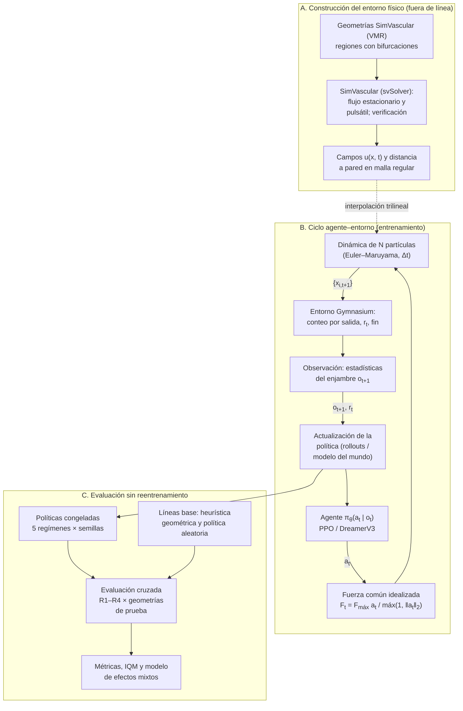

# TesisMIA_Magnetic-Nanoswarm_RL

**Evaluación del impacto de la fidelidad física de entornos vasculares simulados en el direccionamiento autónomo de enjambres de nanopartículas magnéticas mediante aprendizaje por refuerzo**

[](https://www.python.org/downloads/)
[](https://gymnasium.farama.org/)

Repositorio del proyecto de tesis de la **Maestría en Ciencias con mención en Inteligencia Artificial**, Unidad de Posgrado de la Facultad de Ingeniería Industrial y de Sistemas, **Universidad Nacional de Ingeniería (UNI)**.

**Alumno:** Brayan Bruce Pérez Escobar

---

## Contenido

1. [Propósito, tipo de tesis y aporte](#1-propósito-tipo-de-tesis-y-aporte)
2. [Diagrama del flujo principal](#2-diagrama-del-flujo-principal)
3. [Entradas, componentes y salidas](#3-entradas-componentes-y-salidas)
4. [Definición del problema de aprendizaje por refuerzo](#4-definición-del-problema-de-aprendizaje-por-refuerzo)
5. [Criterio preliminar de evaluación](#5-criterio-preliminar-de-evaluación)
6. [Control experimental y reproducibilidad](#6-control-experimental-y-reproducibilidad)
7. [Riesgos técnicos y mitigación](#7-riesgos-técnicos-y-mitigación)
8. [Viabilidad](#8-viabilidad)
9. [Ejecución](#9-ejecución)
10. [Referencias](#referencias)

---

## 1. Propósito, tipo de tesis y aporte

La tesis es de **aprendizaje por refuerzo (RL)**. Un único controlador aplica una fuerza magnética externa, común e idealizada, sobre un enjambre diluido de $N$ nanopartículas no interactuantes que son transportadas por el flujo sanguíneo. La tarea consiste en dirigir la mayor fracción posible del enjambre hacia la **rama objetivo** a través de las bifurcaciones de geometrías vasculares tridimensionales obtenidas con SimVascular (Updegrove et al., 2017). La navegación contra el flujo queda fuera del alcance.

La fidelidad física se manipula mediante cuatro condiciones anidadas:

| Condición | Descripción |
|:---:|---|
| **R1** | Sin flujo |
| **R2** | Flujo estacionario |
| **R3** | Flujo pulsátil |
| **R4** | Flujo pulsátil con movimiento browniano |

Trabajos recientes muestran que políticas entrenadas en simulaciones simplificadas fallan al incorporar flujo (Medany et al., 2025); por ello, el aporte de la tesis es **metodológico en RL**:

1. Un entorno abierto con niveles de fidelidad parametrizados y verificados.
2. Un protocolo de evaluación cruzada, completamente en simulación, en el que cada política entrenada en una condición $R_k$ se evalúa en las cuatro condiciones R1–R4.
3. Un currículo de fidelidad R1 → R4 (Bengio et al., 2009) comparado con el entrenamiento en condición fija.
4. Evidencia comparativa entre PPO, *model-free* (Schulman et al., 2017), y DreamerV3, *model-based* (Hafner et al., 2025).

## 2. Diagrama del flujo principal



*Figura 1: Flujo del proyecto: construcción del entorno, ciclo agente–entorno y evaluación cruzada.*

## 3. Entradas, componentes y salidas

| Etapa | Recibe | Produce |
|---|---|---|
| **Geometrías** (SimVascular) | Modelos del Vascular Model Repository de SimVascular (Wilson et al., 2013) (anatomía, paciente y licencia documentados) | Regiones de interés con bifurcaciones, línea central y malla generadas en SimVascular; partición por paciente en entrenamiento, validación y prueba |
| **Hemodinámica** (svSolver de SimVascular) | Malla, propiedades del fluido, caudal constante o pulsátil, salidas RCR | Campos de velocidad por condición, verificados (Hagen–Poiseuille, malla, paso temporal, masa) |
| **Régimen físico** | Radio de partícula, viscosidad, temperatura, $F_{\max}$, caudal | $Re_p$, Péclet, Womersley y $ML/R$ con $M = F_{\max}/(\zeta U)$; escala y parámetros justificados |
| **Validación** | Experimento publicado de direccionamiento magnético en una bifurcación en Y | Error entre la fracción simulada y la reportada por rama |
| **Entorno RL** | Campos, geometría, condición $R_k$, semilla | Transiciones $(o_t, a_t, r_t, o_{t+1})$ y registro por episodio |
| **Entrenamiento** | Algoritmo, régimen, semilla, presupuesto fijo de interacciones | Política congelada, curva de aprendizaje y costo computacional |
| **Evaluación** | Políticas, líneas base, condiciones y geometrías de prueba | Métricas por episodio, análisis estadístico y tablas reproducibles |

## 4. Definición del problema de aprendizaje por refuerzo

**Entorno.** Cada partícula evoluciona según

$$
d\mathbf{x}_i = \left[\mathbf{u}(\mathbf{x}_i, t) + \frac{\mathbf{F}_t}{\zeta}\right] dt + \sqrt{2D}\, d\mathbf{W}_i ,
$$

integrada con Euler–Maruyama de forma vectorizada. El flujo se anula en R1 y el término browniano solo se activa en R4. Las paredes son reflectantes y cada partícula que abandona el dominio se contabiliza en la salida correspondiente.

**Observación.** Vector de dimensión fija con:
- el centroide del enjambre relativo a la próxima bifurcación;
- su dispersión (desviaciones principales);
- la dirección de la línea central hacia la rama objetivo;
- la velocidad media del flujo en el centroide;
- las fracciones ya entregadas por salida;
- la fase pulsátil $(\sin\varphi_t, \cos\varphi_t)$;
- la acción previa.

Se trata de observación idealizada; no se evalúa la localización del enjambre.

**Acción.** $a_t \in [-1, 1]^3$, transformada en una fuerza común de magnitud máxima $F_{\max}$,

$$
\mathbf{F}_t = F_{\max}\, \frac{a_t}{\max(1, \lVert a_t \rVert_2)} ,
$$

igual para todos los algoritmos y verificada mediante $ML/R$.

**Recompensa.**

$$
r_t = w_p\, \Delta \bar{d}_{\text{vasc}} + w_e\, \Delta \eta_{\text{obj}} - w_m\, \Delta \eta_{\text{otras}} - w_u \lVert a_t \rVert_2^2
$$

donde $\Delta \bar{d}_{\text{vasc}}$ es la reducción de la distancia vascular media de las partículas activas hacia la salida objetivo y $\Delta\eta$ el incremento de la fracción entregada a la rama objetivo o a otras salidas. La distancia se mide sobre la línea central y no en línea recta. Los pesos se fijan en la prueba piloto con análisis de sensibilidad, se verifica que la línea base obtenga un comportamiento razonable y se congelan antes del experimento confirmatorio.

**Episodio.** Inicia con el enjambre liberado en la entrada con posiciones aleatorias en la sección transversal y termina cuando una fracción $\eta_{\text{fin}}$ del enjambre ha salido del dominio o se alcanza el horizonte $H$.

**Líneas base.** Heurística geométrica que aplica, en cada bifurcación, la fuerza máxima perpendicular a la línea central en dirección de la rama objetivo, y política aleatoria.

**Regímenes y repeticiones.** Cinco regímenes de entrenamiento: fijo en R1, R2, R3 o R4, y currículo R1 → R4 que avanza al superar un umbral en validación.

| Bloque | Configuración | Entrenamientos |
|---|---|:---:|
| Núcleo | PPO con 5 semillas | 25 |
| Extensión | DreamerV3 y 10 semillas por régimen | hasta 100 |

Cada política se evalúa en las cuatro condiciones y en todas las geometrías de prueba con 100 episodios por celda.

## 5. Criterio preliminar de evaluación

La métrica principal es la **eficiencia de direccionamiento**

$$
\eta = \frac{N_{\text{obj}}}{N},
$$

fracción del enjambre entregada a la rama objetivo, medida en las geometrías de prueba para cada celda de la matriz entrenamiento × prueba:
- **diagonal:** dentro del dominio;
- **sobre la diagonal:** transferencia a mayor fidelidad;
- **bajo la diagonal:** simplificación.

**Aceptable.** La política supera a la heurística geométrica en al menos $\Delta\eta_{\min}$ en la geometría de validación; $\Delta\eta_{\min}$ se fija antes del experimento confirmatorio.

**Mejor.** Diferencias entre regímenes o algoritmos iguales o mayores que $\Delta\eta_{\min}$. Se reportan la media intercuartílica (IQM) con intervalos por *bootstrap* estratificado y la probabilidad de mejora (Agarwal et al., 2021). Los conteos por episodio se analizan con un modelo binomial de efectos mixtos con efectos fijos de algoritmo, régimen de entrenamiento, condición de prueba y sus interacciones, y efectos aleatorios de política y geometría; corrección de Holm con $\alpha = 0.05$.

**Complementarias.** Fracción perdida en otras salidas, dispersión final del enjambre, tiempo de tránsito, esfuerzo de control, brecha de fidelidad $\eta_{\text{in}} - \eta_{\text{out}}$ y eficiencia muestral como área bajo la curva de aprendizaje con presupuesto fijo. El retorno acumulado se usa solo como diagnóstico y la estabilidad se mide con el rango intercuartílico entre semillas.

## 6. Control experimental y reproducibilidad

**Separación de datos.** Las particiones se hacen por paciente para evitar fuga entre geometrías del mismo individuo. Las geometrías de entrenamiento se muestrean al azar por episodio; la de validación ajusta hiperparámetros, recompensa y avance del currículo; las de prueba solo se usan en la evaluación final. La prueba piloto no forma parte del análisis confirmatorio.

**Comparación equitativa.** Ambos algoritmos comparten entorno, observación, acción, recompensa, presupuesto de interacciones, frecuencia de evaluación y número de pruebas de ajuste de hiperparámetros. El tiempo de cómputo se reporta como propiedad de cada implementación (Stable-Baselines3 en PyTorch, Raffin et al., 2021, y DreamerV3 en JAX).

**Preregistro y potencia.** Hipótesis, métricas, $\Delta\eta_{\min}$ y análisis se registran con fecha en el repositorio antes del experimento confirmatorio. El número de semillas se justifica con un análisis de potencia basado en la varianza observada en el piloto.

**Versionado y registro.**
- Código en Git y dependencias con versiones exactas.
- Huellas SHA-256 de mallas y campos.
- Un archivo YAML y un identificador único por ejecución (algoritmo, régimen, semilla).
- Semillas fijas para NumPy, PyTorch/JAX, el entorno y el ruido browniano.
- Curvas en TensorBoard y registros CSV por episodio (condición, geometría, conteos por salida, acciones, recompensa, motivo de fin), además del hardware y tiempos.
- Los datos brutos no se modifican y las tablas y figuras se generan con scripts.
- El entorno y las particiones se publicarán como benchmark abierto.

## 7. Riesgos técnicos y mitigación

| Riesgo | Detección y mitigación |
|---|---|
| Desvío físicamente inviable a escala anatómica ($ML/R \ll 1$) | Análisis adimensional previo al entrenamiento; de ser necesario, uso de la geometría escalada como fantoma microfluídico, declarado como supuesto |
| Costo del CFD pulsátil en anatomía real | Regiones de interés recortadas; campos precomputados una vez y remuestreados en malla regular |
| Costo de simular $N$ partículas | Integración vectorizada; $N$ fijado en el piloto según la convergencia de $\eta$ frente a $N$ |
| Recompensa explotable | Distancia vascular; verificación con la línea base; revisión visual de trayectorias |
| Fuga de información | Partición por paciente; geometrías de prueba aisladas desde el inicio |
| Alta varianza entre semillas | IQM, *bootstrap* estratificado, curvas individuales; ninguna ejecución se elimina por bajo desempeño |
| Costo de DreamerV3 o falta de datos experimentales para validar | DreamerV3 como extensión condicionada al costo medido en el piloto; si no hay datos comparables, el modelo se reporta como verificado y no validado |

## 8. Viabilidad

El flujo usa herramientas abiertas (SimVascular, Python, Gymnasium (Towers et al., 2024), Stable-Baselines3 y DreamerV3) y se ejecuta por niveles:

1. **Primero:** el entorno en una geometría con la línea base y la verificación física.
2. **Luego:** el núcleo con PPO.
3. **Finalmente:** las extensiones.

Si solo se completa el núcleo, la tesis responde igualmente sus preguntas principales.

## 9. Ejecución

Estado actual: entorno mínimo v0.1 (bifurcación en Y 2D con flujo analítico) y políticas de referencia. Diseño en [docs/diseno_entorno.md](docs/diseno_entorno.md), resultados del primer sprint en [docs/eda_baseline.md](docs/eda_baseline.md) y decisiones en [docs/bitacora.md](docs/bitacora.md).

**Instalación** (Python 3.10+, Windows PowerShell):

```powershell
python -m venv .venv
.\.venv\Scripts\Activate.ps1
pip install -r requirements.txt
pip install -e . --no-deps
```

**Evaluación de las políticas de referencia** en R1–R4 (~2 min):

```powershell
python scripts/evaluate.py --tag baseline --episodes 30
```

Escribe `logs/metrics_baseline.txt` (metadatos, configuración y η con IC 95 %) y `results/tables/episodes_baseline.csv` (una fila por episodio). Opciones: `--policies`, `--conditions`, `--seed`, `--n-particles`, `--v-mag`.

**EDA del entorno** (~4 min, requiere la evaluación anterior):

```powershell
python scripts/eda.py
```

Escribe `logs/metrics_eda.txt`, las figuras en `results/figures/` y las tablas en `results/tables/`.

## Referencias

- Agarwal, R., Schwarzer, M., Castro, P. S., Courville, A., y Bellemare, M. G. (2021). Deep reinforcement learning at the edge of the statistical precipice. *Advances in Neural Information Processing Systems*, 34, 29304–29320.
- Bengio, Y., Louradour, J., Collobert, R., y Weston, J. (2009). Curriculum learning. En *Proceedings of the 26th International Conference on Machine Learning* (pp. 41–48).
- Hafner, D., Pasukonis, J., Ba, J., y Lillicrap, T. (2025). Mastering diverse control tasks through world models. *Nature*, 640, 647–653.
- Medany, M., Piglia, L., Achenbach, L., Mukkavilli, S. K., y Ahmed, D. (2025). Model-based reinforcement learning for ultrasound-driven autonomous microrobots. *Nature Machine Intelligence*, 7, 1076–1090. https://doi.org/10.1038/s42256-025-01054-2
- Raffin, A., Hill, A., Gleave, A., Kanervisto, A., Ernestus, M., y Dormann, N. (2021). Stable-Baselines3: Reliable reinforcement learning implementations. *Journal of Machine Learning Research*, 22(268), 1–8.
- Schulman, J., Wolski, F., Dhariwal, P., Radford, A., y Klimov, O. (2017). Proximal policy optimization algorithms. *arXiv preprint arXiv:1707.06347*.
- Towers, M., et al. (2024). Gymnasium: A standard interface for reinforcement learning environments. *arXiv preprint arXiv:2407.17032*.
- Updegrove, A., Wilson, N. M., Merkow, J., Lan, H., Marsden, A. L., y Shadden, S. C. (2017). SimVascular: An open source pipeline for cardiovascular simulation. *Annals of Biomedical Engineering*, 45(3), 525–541.
- Wilson, N. M., Ortiz, A. K., y Johnson, A. B. (2013). The vascular model repository: A public resource of medical imaging data and blood flow simulation results. *Journal of Medical Devices*, 7(4), 040923.
