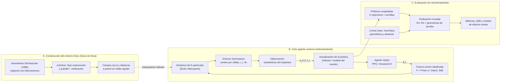

# TesisMIA_Magnetic-Nanoswarm_RL

**Evaluación del impacto de la fidelidad física de entornos vasculares simulados en el direccionamiento autónomo de enjambres de nanopartículas magnéticas mediante aprendizaje por refuerzo**

[](https://opensource.org/licenses/MIT)
[](https://www.python.org/downloads/)
[](https://gymnasium.farama.org/)
[](https://stable-baselines3.readthedocs.io/)
[](https://simvascular.github.io/)
[](#estado-y-hoja-de-ruta)

Implementación reproducible y marco experimental del proyecto de tesis de la **Maestría en Ciencias con mención en Inteligencia Artificial**, Unidad de Posgrado de la Facultad de Ingeniería Industrial y de Sistemas, **Universidad Nacional de Ingeniería (UNI)**, Lima, Perú.

**Autor:** Brayan Bruce Pérez Escobar

---

## Contenido

- [Resumen](#resumen)
- [Aportes](#aportes)
- [Condiciones de fidelidad física](#condiciones-de-fidelidad-física)
- [Flujo del proyecto](#flujo-del-proyecto)
- [Formulación del problema de RL](#formulación-del-problema-de-rl)
- [Diseño experimental](#diseño-experimental)
- [Métricas y análisis estadístico](#métricas-y-análisis-estadístico)
- [Estructura del repositorio](#estructura-del-repositorio)
- [Instalación](#instalación)
- [Uso](#uso)
- [Reproducibilidad](#reproducibilidad)
- [Estado y hoja de ruta](#estado-y-hoja-de-ruta)
- [Cita](#cita)
- [Referencias](#referencias)
- [Licencia](#licencia)

---

## Resumen

Un único controlador aplica una **fuerza magnética externa, común e idealizada**, sobre un enjambre diluido de $N$ nanopartículas no interactuantes transportadas por el flujo sanguíneo. La tarea es dirigir la mayor fracción posible del enjambre hacia una **rama objetivo** a través de las bifurcaciones de geometrías vasculares tridimensionales obtenidas con SimVascular. La navegación contra el flujo queda fuera del alcance.

Trabajos recientes muestran que políticas entrenadas en simulaciones simplificadas fallan al incorporar flujo (Medany et al., 2025). Esta tesis estudia de forma sistemática **cómo la fidelidad física del entorno de entrenamiento afecta el desempeño y la transferencia** de las políticas de RL, evaluando cada política en condiciones de fidelidad distintas a la de entrenamiento, completamente en simulación.

## Aportes

El aporte es **metodológico en aprendizaje por refuerzo**:

1. **Entorno abierto con fidelidad parametrizada y verificada**, implementado en Gymnasium, con cuatro condiciones físicas anidadas (R1–R4).
2. **Protocolo de evaluación cruzada**: cada política entrenada en una condición $R_k$ se evalúa, sin reentrenamiento, en las cuatro condiciones R1–R4.
3. **Currículo de fidelidad** R1 → R4 (Bengio et al., 2009), comparado con el entrenamiento en condición fija.
4. **Evidencia comparativa entre algoritmos**: PPO, *model-free* (Schulman et al., 2017), y DreamerV3, *model-based* (Hafner et al., 2025).

## Condiciones de fidelidad física

| Condición | Flujo sanguíneo | Movimiento browniano | Descripción |
|:---:|:---:|:---:|---|
| **R1** | — | — | Sin flujo: solo fuerza magnética |
| **R2** | Estacionario | — | Campo de velocidad constante en el tiempo |
| **R3** | Pulsátil | — | Campo de velocidad periódico (ciclo cardiaco) |
| **R4** | Pulsátil | ✓ | Flujo pulsátil más difusión térmica |

Las condiciones son **anidadas**: cada una añade un único fenómeno físico a la anterior, lo que permite atribuir las diferencias de desempeño a ese fenómeno.

## Flujo del proyecto



### Entradas y salidas por etapa

| Etapa | Recibe | Produce |
|---|---|---|
| **Geometrías** | Modelos del Vascular Model Repository (anatomía, paciente y licencia documentados) | Regiones de interés con bifurcaciones, línea central y malla; partición por paciente en entrenamiento, validación y prueba |
| **Hemodinámica** (svSolver) | Malla, propiedades del fluido, caudal constante o pulsátil, salidas RCR | Campos de velocidad por condición, verificados (Hagen–Poiseuille, independencia de malla y de paso temporal, conservación de masa) |
| **Régimen físico** | Radio de partícula, viscosidad, temperatura, $F_{\max}$, caudal | Números adimensionales $Re_p$, Péclet, Womersley y $ML/R$ con $M = F_{\max}/(\zeta U)$ |
| **Validación** | Experimento publicado de direccionamiento magnético en una bifurcación en Y | Error entre la fracción simulada y la reportada por rama |
| **Entorno RL** | Campos, geometría, condición $R_k$, semilla | Transiciones $(o_t, a_t, r_t, o_{t+1})$ y registro por episodio |
| **Entrenamiento** | Algoritmo, régimen, semilla, presupuesto fijo de interacciones | Política congelada, curva de aprendizaje y costo computacional |
| **Evaluación** | Políticas, líneas base, condiciones y geometrías de prueba | Métricas por episodio, análisis estadístico y tablas reproducibles |

## Formulación del problema de RL

**Dinámica.** Cada partícula evoluciona según la ecuación diferencial estocástica

$$
d\mathbf{x}_i = \left[\mathbf{u}(\mathbf{x}_i, t) + \frac{\mathbf{F}_t}{\zeta}\right] dt + \sqrt{2D}\, d\mathbf{W}_i ,
$$

integrada con Euler–Maruyama de forma vectorizada. El flujo $\mathbf{u}$ se anula en R1 y el término browniano solo se activa en R4. Las paredes son reflectantes y cada partícula que abandona el dominio se contabiliza en su salida.

**Observación** $o_t$ (vector de dimensión fija, idealizada; no se evalúa la localización del enjambre):
- centroide del enjambre relativo a la próxima bifurcación y su dispersión (desviaciones principales);
- dirección de la línea central hacia la rama objetivo;
- velocidad media del flujo en el centroide;
- fracciones ya entregadas por salida;
- fase pulsátil $(\sin\varphi_t, \cos\varphi_t)$;
- acción previa.

**Acción.** $a_t \in [-1, 1]^3$, transformada en una fuerza común

$$
\mathbf{F}_t = F_{\max}\, \frac{a_t}{\max(1, \lVert a_t \rVert_2)} ,
$$

idéntica para todos los algoritmos.

**Recompensa.**

$$
r_t = w_p\, \Delta \bar{d}_{\text{vasc}} + w_e\, \Delta \eta_{\text{obj}} - w_m\, \Delta \eta_{\text{otras}} - w_u \lVert a_t \rVert_2^2
$$

donde $\Delta \bar{d}_{\text{vasc}}$ es la reducción de la distancia vascular media (medida sobre la línea central, no en línea recta) de las partículas activas hacia la salida objetivo, y $\Delta\eta$ es el incremento de la fracción entregada a la rama objetivo o a otras salidas. Los pesos se fijan en la prueba piloto con análisis de sensibilidad y se congelan antes del experimento confirmatorio.

**Episodio.** Inicia con el enjambre liberado en la entrada, con posiciones aleatorias en la sección transversal, y termina cuando una fracción $\eta_{\text{fin}}$ ha salido del dominio o se alcanza el horizonte $H$.

**Líneas base.**
- *Heurística geométrica*: en cada bifurcación aplica la fuerza máxima perpendicular a la línea central, en dirección de la rama objetivo.
- *Política aleatoria*.

## Diseño experimental

**Regímenes de entrenamiento (5):** fijo en R1, R2, R3 o R4, y currículo R1 → R4 que avanza al superar un umbral en validación.

| Bloque | Algoritmos | Semillas por régimen | Entrenamientos |
|---|---|:---:|:---:|
| Núcleo | PPO | 5 | 25 |
| Extensión | PPO + DreamerV3 | 10 | hasta 100 |

**Matriz de evaluación cruzada.** Cada política se evalúa en las cuatro condiciones y en todas las geometrías de prueba, con 100 episodios por celda:

| Entrenada en ↓ / Evaluada en → | R1 | R2 | R3 | R4 |
|---|:---:|:---:|:---:|:---:|
| R1 | dentro | ↑ mayor fidelidad | ↑ | ↑ |
| R2 | ↓ simplificación | dentro | ↑ | ↑ |
| R3 | ↓ | ↓ | dentro | ↑ |
| R4 | ↓ | ↓ | ↓ | dentro |
| Currículo R1→R4 | · | · | · | · |

Diagonal: desempeño dentro del dominio. Sobre la diagonal: transferencia a mayor fidelidad. Bajo la diagonal: transferencia a una física simplificada.

## Métricas y análisis estadístico

**Métrica principal:** eficiencia de direccionamiento

$$
\eta = \frac{N_{\text{obj}}}{N},
$$

fracción del enjambre entregada a la rama objetivo, medida en las geometrías de prueba para cada celda de la matriz.

**Criterios de éxito.**
- *Aceptable:* la política supera a la heurística geométrica en al menos $\Delta\eta_{\min}$ en la geometría de validación ($\Delta\eta_{\min}$ se preregistra).
- *Mejor:* diferencias entre regímenes o algoritmos iguales o mayores que $\Delta\eta_{\min}$.

**Análisis.**
- Media intercuartílica (IQM) con intervalos por *bootstrap* estratificado y probabilidad de mejora (Agarwal et al., 2021).
- Modelo binomial de efectos mixtos sobre los conteos por episodio: efectos fijos de algoritmo, régimen, condición de prueba e interacciones; efectos aleatorios de política y geometría. Corrección de Holm con $\alpha = 0.05$.

**Métricas complementarias:** fracción perdida en otras salidas, dispersión final del enjambre, tiempo de tránsito, esfuerzo de control, brecha de fidelidad $\eta_{\text{in}} - \eta_{\text{out}}$ y eficiencia muestral (área bajo la curva de aprendizaje con presupuesto fijo). El retorno acumulado se usa solo como diagnóstico; la estabilidad se mide con el rango intercuartílico entre semillas.

## Estructura del repositorio

> Estructura prevista; puede ajustarse a medida que avance la implementación.

```text
TesisMIA_Magnetic-Nanoswarm_RL/
├── configs/                 # YAML por ejecución (algoritmo, régimen, semilla, física)
│   ├── physics/             # parámetros de R1–R4 y régimen adimensional
│   ├── train/               # PPO, DreamerV3, currículo
│   └── eval/                # matriz de evaluación cruzada
├── data/
│   ├── geometries/          # modelos VMR y particiones por paciente (+ huellas SHA-256)
│   └── fields/              # campos u(x,t) remuestreados en malla regular
├── cfd/                     # scripts de SimVascular/svSolver y verificación
├── src/nanoswarm/
│   ├── envs/                # entorno Gymnasium (dinámica, observación, recompensa)
│   ├── physics/             # interpolación trilineal, Euler–Maruyama, paredes
│   ├── baselines/           # heurística geométrica y política aleatoria
│   ├── agents/              # envoltorios de PPO (SB3) y DreamerV3 (JAX)
│   └── analysis/            # IQM, bootstrap, modelos de efectos mixtos
├── scripts/                 # entrenamiento, evaluación y generación de tablas/figuras
├── preregistration/         # hipótesis, métricas y Δη_mín con fecha
├── results/                 # registros CSV, TensorBoard, tablas y figuras (generados)
├── tests/                   # pruebas unitarias y verificación física
├── environment.yml
├── requirements.txt
└── README.md
```

## Instalación

```bash
git clone https://github.com/<usuario>/TesisMIA_Magnetic-Nanoswarm_RL.git
cd TesisMIA_Magnetic-Nanoswarm_RL

# Entorno de Python
conda env create -f environment.yml
conda activate nanoswarm-rl
# o bien: python -m venv .venv && source .venv/bin/activate && pip install -r requirements.txt

pip install -e .
```

**Dependencias externas**
- [SimVascular](https://simvascular.github.io/) (solo para regenerar geometrías y campos CFD; los campos precomputados se distribuyen con el repositorio o se descargan aparte).
- DreamerV3 requiere JAX con soporte de GPU (solo para la extensión).

## Uso

> Los comandos describen la interfaz prevista.

```bash
# 1. Verificación física del entorno (Hagen–Poiseuille, malla, masa) y régimen adimensional
python scripts/verify_physics.py --config configs/physics/default.yaml

# 2. Línea base en una geometría
python scripts/evaluate.py --policy heuristic --condition R2 --split val

# 3. Entrenamiento (un régimen, una semilla)
python scripts/train.py --algo ppo --regime R3 --seed 0
python scripts/train.py --algo ppo --regime curriculum --seed 0

# 4. Evaluación cruzada de todas las políticas congeladas
python scripts/cross_evaluate.py --runs results/runs/ --split test --episodes 100

# 5. Tablas y figuras del análisis estadístico
python scripts/make_report.py --input results/eval/ --output results/figures/
```

Uso directo del entorno:

```python
import gymnasium as gym
import nanoswarm  # registra los entornos

env = gym.make("NanoSwarm-v0", condition="R3", geometry_split="train", n_particles=1000)
obs, info = env.reset(seed=0)
done = False
while not done:
    action = env.action_space.sample()
    obs, reward, terminated, truncated, info = env.step(action)
    done = terminated or truncated
print(info["eta_target"])
```

## Reproducibilidad

- **Separación de datos por paciente**, para evitar fuga entre geometrías del mismo individuo. Entrenamiento: geometrías muestreadas al azar por episodio. Validación: hiperparámetros, recompensa y avance del currículo. Prueba: solo evaluación final. La prueba piloto no forma parte del análisis confirmatorio.
- **Comparación equitativa**: ambos algoritmos comparten entorno, observación, acción, recompensa, presupuesto de interacciones, frecuencia de evaluación y número de pruebas de ajuste de hiperparámetros. El tiempo de cómputo se reporta como propiedad de cada implementación.
- **Preregistro**: hipótesis, métricas, $\Delta\eta_{\min}$ y análisis se registran con fecha en `preregistration/` antes del experimento confirmatorio. El número de semillas se justifica con un análisis de potencia basado en la varianza del piloto.
- **Versionado**: código en Git, dependencias con versiones exactas, huellas SHA-256 de mallas y campos, un YAML y un identificador único por ejecución (algoritmo, régimen, semilla).
- **Semillas fijas** para NumPy, PyTorch/JAX, el entorno y el ruido browniano.
- **Registro**: curvas en TensorBoard y CSV por episodio (condición, geometría, conteos por salida, acciones, recompensa, motivo de fin), hardware y tiempos.
- **Datos inmutables**: los datos brutos no se modifican; todas las tablas y figuras se generan con scripts.
- Ninguna ejecución se elimina por bajo desempeño.

## Estado y hoja de ruta

El proyecto se ejecuta por niveles; si solo se completa el núcleo, la tesis responde igualmente sus preguntas principales.

- [x] Diseño del flujo reproducible (Proyecto de Investigación II, semana 2)
- [ ] Selección de geometrías VMR y partición por paciente
- [ ] Simulaciones CFD (estacionario y pulsátil) y verificación
- [ ] Análisis adimensional ($ML/R$) y validación con experimento en bifurcación en Y
- [ ] Entorno Gymnasium R1–R4 con línea base heurística
- [ ] Prueba piloto: $N$, pesos de recompensa, análisis de potencia y preregistro
- [ ] **Núcleo:** PPO, 5 regímenes × 5 semillas, evaluación cruzada
- [ ] **Extensión:** DreamerV3 y 10 semillas por régimen
- [ ] Publicación del entorno y las particiones como benchmark abierto

### Riesgos principales

| Riesgo | Mitigación |
|---|---|
| Desvío físicamente inviable a escala anatómica ($ML/R \ll 1$) | Análisis adimensional previo; de ser necesario, geometría escalada como fantoma microfluídico, declarado como supuesto |
| Costo del CFD pulsátil en anatomía real | Regiones de interés recortadas; campos precomputados una vez y remuestreados en malla regular |
| Costo de simular $N$ partículas | Integración vectorizada; $N$ fijado según la convergencia de $\eta$ frente a $N$ |
| Recompensa explotable | Distancia vascular; verificación con la línea base; revisión visual de trayectorias |
| Alta varianza entre semillas | IQM, *bootstrap* estratificado, curvas individuales |
| Costo de DreamerV3 o falta de datos experimentales | DreamerV3 como extensión condicionada al costo del piloto; sin datos comparables, el modelo se reporta como verificado y no validado |

## Cita

Si utilizas este entorno o protocolo, por favor cita:

```bibtex
@mastersthesis{perez2026nanoswarm,
  author  = {Pérez Escobar, Brayan Bruce},
  title   = {Evaluación del impacto de la fidelidad física de entornos vasculares simulados
             en el direccionamiento autónomo de enjambres de nanopartículas magnéticas
             mediante aprendizaje por refuerzo},
  school  = {Universidad Nacional de Ingeniería},
  address = {Lima, Perú},
  year    = {2026},
  type    = {Tesis de Maestría en Ciencias con mención en Inteligencia Artificial}
}
```

## Referencias

- Agarwal, R., Schwarzer, M., Castro, P. S., Courville, A., y Bellemare, M. G. (2021). Deep reinforcement learning at the edge of the statistical precipice. *NeurIPS*, 34, 29304–29320.
- Bengio, Y., Louradour, J., Collobert, R., y Weston, J. (2009). Curriculum learning. *ICML*, 41–48.
- Hafner, D., Pasukonis, J., Ba, J., y Lillicrap, T. (2025). Mastering diverse control tasks through world models. *Nature*, 640, 647–653.
- Medany, M., Piglia, L., Achenbach, L., Mukkavilli, S. K., y Ahmed, D. (2025). Model-based reinforcement learning for ultrasound-driven autonomous microrobots. *Nature Machine Intelligence*, 7, 1076–1090. https://doi.org/10.1038/s42256-025-01054-2
- Raffin, A., Hill, A., Gleave, A., Kanervisto, A., Ernestus, M., y Dormann, N. (2021). Stable-Baselines3: Reliable reinforcement learning implementations. *JMLR*, 22(268), 1–8.
- Schulman, J., Wolski, F., Dhariwal, P., Radford, A., y Klimov, O. (2017). Proximal policy optimization algorithms. *arXiv:1707.06347*.
- Towers, M., et al. (2024). Gymnasium: A standard interface for reinforcement learning environments. *arXiv:2407.17032*.
- Updegrove, A., Wilson, N. M., Merkow, J., Lan, H., Marsden, A. L., y Shadden, S. C. (2017). SimVascular: An open source pipeline for cardiovascular simulation. *Annals of Biomedical Engineering*, 45(3), 525–541.
- Wilson, N. M., Ortiz, A. K., y Johnson, A. B. (2013). The vascular model repository: A public resource of medical imaging data and blood flow simulation results. *Journal of Medical Devices*, 7(4), 040923.

## Licencia

Código distribuido bajo la licencia [MIT](LICENSE). Las geometrías del Vascular Model Repository conservan su licencia original, documentada por modelo en `data/geometries/`.
