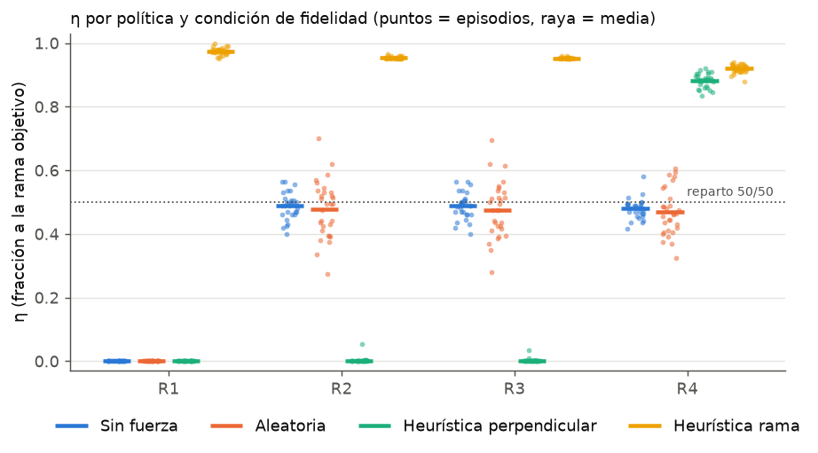
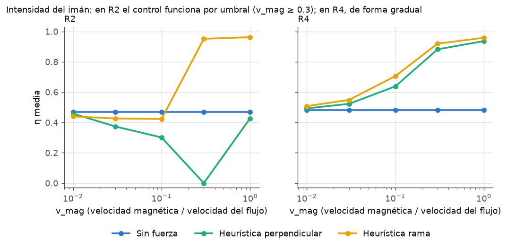
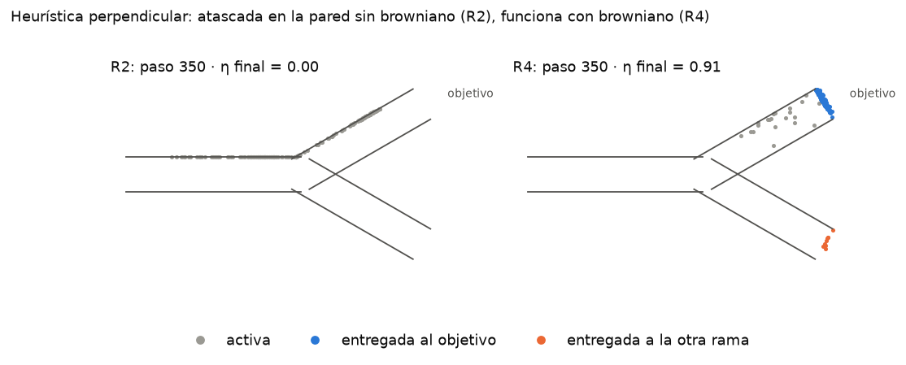

# EDA y baseline mínimo — Sprint 1

**Curso:** Proyecto de Investigación 2 · **Fecha:** 2026-10-09 · **Entorno:** v0.1 ([diseño](diseno_entorno.md))

## 1. Contexto

- **Objetivo:** dirigir un enjambre de N nanopartículas magnéticas hacia la rama objetivo de una bifurcación vascular con aprendizaje por refuerzo.
- **Métrica central:** eficiencia de direccionamiento $\eta = N_{obj}/N$.
- **Datos:** en RL no hay un dataset fijo. Los datos son las **trayectorias que genera el entorno** (observaciones, acciones, recompensas y conteos por salida) al ejecutar políticas en las cuatro condiciones de fidelidad física (R1 sin flujo, R2 estacionario, R3 pulsátil, R4 pulsátil + browniano).
- **Punto de partida:** Medany et al. (2025) observaron que las políticas entrenadas sin flujo fallan con flujo, pero no lo estudiaron de forma sistemática. Este proyecto mide ese efecto de manera controlada.

## 2. Baseline

| Rol | Política | Por qué es el mínimo razonable |
|---|---|---|
| Dummy | **Sin fuerza** | Reparto natural del flujo: el equivalente a "predecir la clase más frecuente" |
| Dummy | **Aleatoria** | Control sin estrategia |
| Modelo simple | **Heurística perpendicular** (la del README) | Regla geométrica sin aprendizaje: empuja perpendicular al canal cerca de la bifurcación |
| Modelo simple | **Heurística rama** | Regla geométrica: empuja en la dirección de la rama objetivo |

PPO es el modelo principal del proyecto y por eso **no** forma parte del baseline.

## 3. Resultados (30 episodios por celda, mismas semillas para todas las políticas)

η media con IC 95 % por bootstrap. Fuente: [logs/metrics_baseline.txt](../logs/metrics_baseline.txt).

| Política | R1 | R2 | R3 | R4 |
|---|---|---|---|---|
| Sin fuerza | 0.000 | 0.488 [0.473, 0.502] | 0.488 [0.473, 0.502] | 0.479 [0.469, 0.490] |
| Aleatoria | 0.000 | 0.477 [0.446, 0.509] | 0.476 [0.445, 0.507] | 0.468 [0.444, 0.493] |
| Heurística perpendicular | 0.000 | **0.002** [0.000, 0.006] | **0.002** [0.000, 0.004] | **0.883** [0.875, 0.890] |
| Heurística rama | 0.975 [0.971, 0.979] | 0.953 [0.952, 0.955] | 0.952 [0.951, 0.953] | 0.920 [0.915, 0.924] |



## 4. EDA

### 4.1 Calidad de los datos

Sobre 29 856 observaciones (4 condiciones × 4 políticas × 3 episodios). Fuente: [logs/metrics_eda.txt](../logs/metrics_eda.txt).

- **Nulos o no finitos:** ninguno en las 11 variables.
- **Rangos:** acotados y coherentes. Centroide x ∈ [−5.0, 3.2] (relativo a la bifurcación), y ∈ [−2.3, 2.4]; fracciones ∈ [0, 1]; fase y acción previa ∈ [−1, 1].
- **Escalas distintas:** el centroide llega a ±5 mientras que las fracciones están en [0, 1]. Habrá que normalizar antes de entrenar PPO.

### 4.2 Distribuciones y relaciones

- **Reparto natural (el "balance de clases"):** sin control, el flujo reparte 49/46 (el resto queda activo). Es el piso que cualquier política debe superar.
- **Intensidad del imán ($v_{mag}$):** en R2 el control funciona por umbral. La heurística rama no supera al reparto natural hasta $v_{mag}$ = 0.3. En R4 mejora de forma gradual desde $v_{mag}$ = 0.03.
- **Tamaño del enjambre:** la desviación estándar de η entre episodios cae de 0.099 (N = 25) a 0.024 (N = 400) sin control, y de 0.040 a 0.009 con la heurística. Con N = 200 es ≤ 0.033.
- **Recompensa frente a métrica:** la correlación de Spearman entre retorno y η es 0.66 en R3 y 0.72 en R2, frente a 0.93 en R4.



### 4.3 Hallazgos

1. **La fidelidad física cambia el ranking de las políticas.** La heurística perpendicular entrega η = 0.00 en R2 y η = 0.88 en R4. Sin browniano, las partículas empujadas contra la pared quedan donde el flujo de Poiseuille es nulo y no avanzan; el browniano las despega. Es la pregunta de la tesis en miniatura: lo que funciona en un nivel de fidelidad puede fallar en otro.
2. **Empujar mal es peor que no empujar.** Con $v_{mag}$ = 0.3 en R2, la heurística perpendicular (η = 0.00) rinde muy por debajo de no hacer nada (η = 0.47).



### 4.4 Riesgos

| Riesgo | Evidencia | Tipo |
|---|---|---|
| **Recompensa explotable** | La heurística perpendicular en R2 obtiene casi el mismo retorno que no hacer nada (0.53 frente a 0.58) con η = 0.00 frente a 0.49. En R4 obtiene más retorno que la heurística rama (1.69 frente a 1.68) con menor η. El término de progreso premia acercarse sin entregar. | Sesgo en la señal de aprendizaje |
| **R3 indistinguible de R2** | η prácticamente idéntica en las cuatro políticas (diferencias ≤ 0.001). El pulso sinusoidal cuasiestacionario se promedia y no aporta contraste de fidelidad. | Sesgo del diseño experimental |
| **Artefacto de partícula puntual** | El atasco en la pared se exagera: una partícula real tiene radio y nunca queda donde el flujo es exactamente cero. | Sesgo del simulador |
| **η topada en ~0.95** | El episodio termina cuando sale el 95 % del enjambre; el resto no se cuenta. | Sesgo de la métrica |
| **Fuga de información** | Todavía no aplica (una sola geometría). Al agregar geometrías, la de prueba debe quedar aislada desde el inicio. | Leakage |

## 5. Decisiones para el siguiente sprint

| # | Decisión | Paso del pipeline | Cómo se mide si funcionó |
|---|---|---|---|
| 1 | **Ajustar** la recompensa: reducir $w_p$ o hacer que el progreso hacia la rama equivocada cuente negativo | Recompensa | Spearman retorno–η ≥ 0.9 en R2 y R3, y la heurística perpendicular en R2 con menos retorno que "sin fuerza" |
| 2 | **Rediseñar** R3: pulso con mayor amplitud o perfil de Womersley, para que difiera de R2 | Datos (entorno) | η de "sin fuerza" o de la heurística en R3 distinta de R2 (IC 95 % sin solapar) |
| 3 | **Agregar** un radio finito de partícula (exclusión de pared) | Datos (entorno) | El atasco en R2 persiste o desaparece; se reporta η de la heurística perpendicular antes y después |


## 6. Reproducibilidad

```powershell
python -m venv .venv
.\.venv\Scripts\Activate.ps1
pip install -r requirements.txt
pip install -e . --no-deps
python scripts/evaluate.py --tag baseline --episodes 30   # ~2 min
python scripts/eda.py                                     # ~4 min
```

- **Semillas:** el episodio *i* usa la semilla `seed + i` (0 por defecto en la evaluación, 1000 en el EDA), la misma para todas las políticas. La política aleatoria usa `seed + i + 10000`.
- **Partición:** una sola geometría en este sprint; no hay partición entrenamiento/prueba todavía.
- **Versionado:** cada log registra la fecha, el commit de git, las versiones de los paquetes y la configuración completa. Las dependencias están congeladas en `requirements.txt`.
- **Salidas:** `logs/metrics_*.txt`, `results/tables/*.csv` y `results/figures/*.png`.

